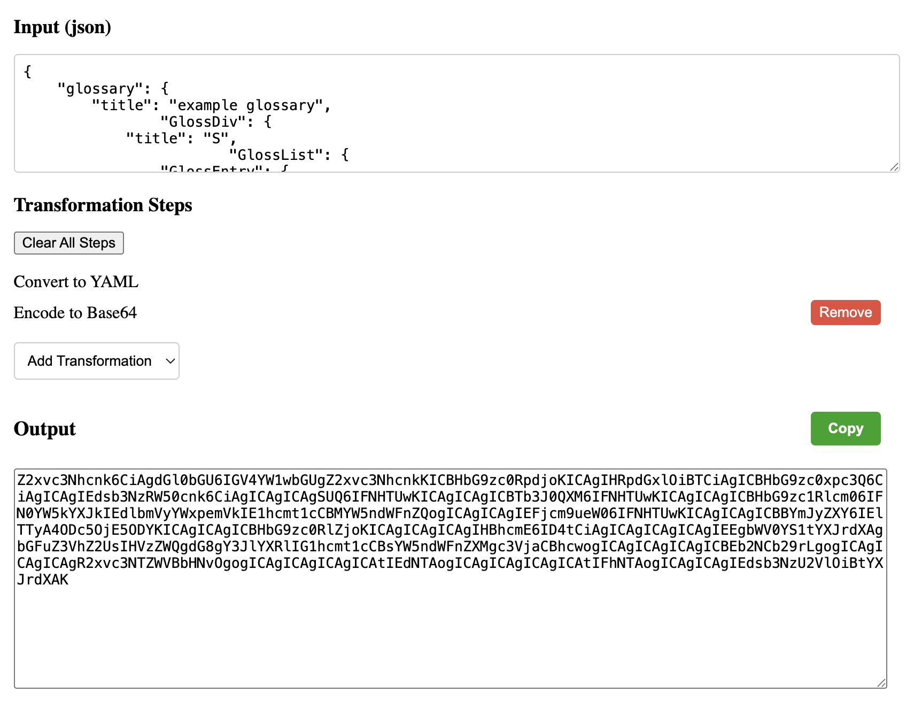
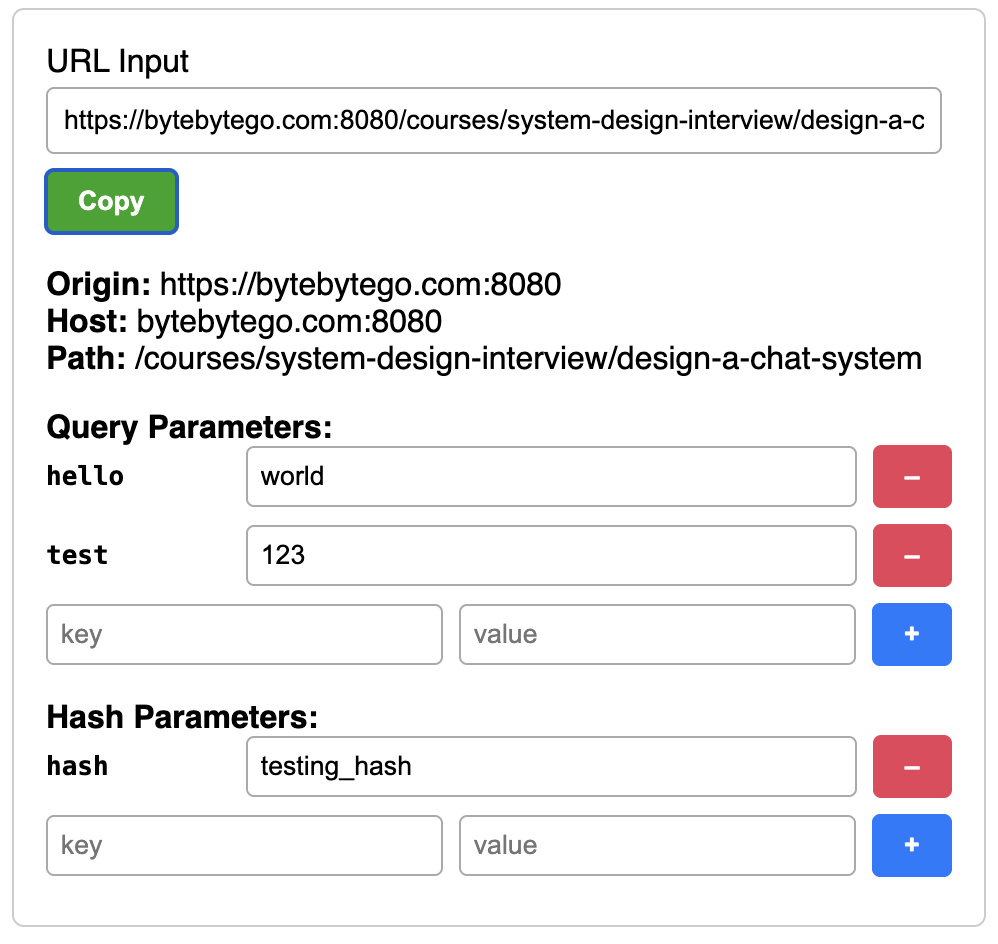
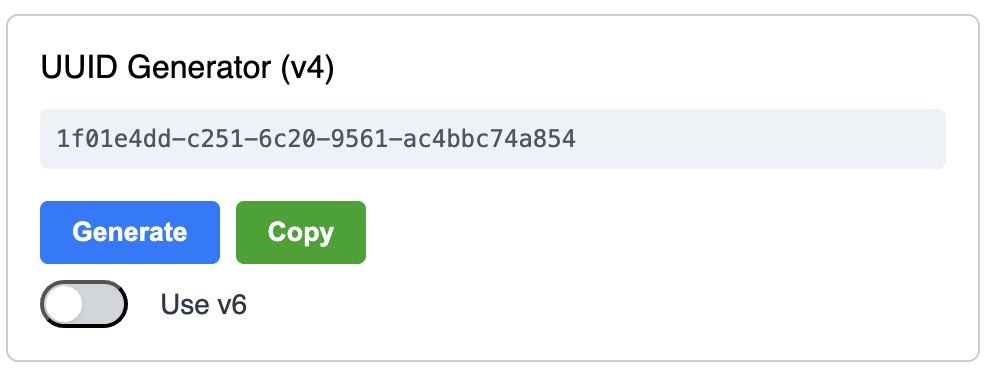

# Dev Toolbox

## Features

### Transformation

Transform input between JSON, YAML, and base64 to your heart's content.

### URL Utilities

Grok URL parts and edit params on the fly.

### UUID Generator

Get a v4 or v6 UUID.

## Roadmap

-   JWT support
-   XML support
-   download output to file
-   save pipeline steps
-   export node executable for entire pipeline transformation (?)
-   jq-like transformations on JSON steps
-   yq-like transformations on YAML steps
